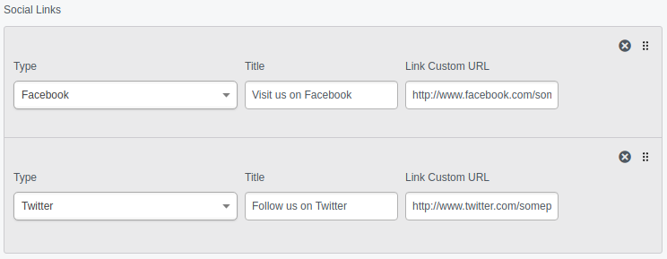

# Documentation & Examples

## Example 1: Serialized has_many relation

This example creates a Page Type `GalleryPage` with a list of Images. The relation to the 
 images is saved as a serialized list of IDs into the `GalleryPage` table.
This means the List of images is also versioned. Reverting to an older version of the Page
 would also restore the previous list of images.

#### DataObject
```php
<?php
	
/**
 * @property string $Title
 * @property \zauberfisch\SerializedDataObject\DBField\DataListField $GalleryImages
 */
class GalleryPage extends Page {
	private static $db = [
		'Title' => 'Varchar(255)',
		'GalleryImages' => \zauberfisch\SerializedDataObject\DBField\DataListField::class,
	];
	
	/**
	 * @return \zauberfisch\SerializedDataObject\DataList
	 */
	public function Images() {
		return $this->obj('GalleryImages')->getValue();
	}
	
	public function getCMSFields() {
		$fields = parent::getCMSFields();
		$fields->addFieldsToTab('Root.Main', [
			new \zauberfisch\SerializedUploadField\UploadField('GalleryImages', $this->fieldLabel('GalleryImages'))
		]);
		return $fields;
	}
}
```
#### Template
```html
<% loop $Images %>
	$ClassName $ID $URL<br>
	<br>
<% end_loop %>
```
## Example 2: Serialized custom DataObject

This example adds a form field for saving a simple serialized DataObject (Social Media Links) to SiteConfig.




#### SerializedDataObject
The object itself for the data to be stored

```php
<?php
class SocialMediaLink extends \zauberfisch\SerializedDataObject\AbstractDataObject {
	private static $fields = [
		'Type',
		'Title',
		'Link',
	];

	public function getCMSFields() {
		$fields = new \FieldList();
		$fields->push(new \FieldGroup([
			new \DropdownField('Type', $this->fieldLabel('Type'), [
				'facebook' => 'Facebook',
				'xing' => 'Xing',
				'linkedin' => 'LinkedIn',
				'instagram' => 'Instagram',
				'flickr' => 'Flickr',
				'twitter' => 'Twitter',
				'youtube' => 'YouTube',
				'google-plus' => 'GooglePlus',
			]),
			new \TextField('Title', $this->fieldLabel('Title')),
			new \TextField('Link', $this->fieldLabel('Link')),
		]));
		return $fields;
	}
}
```

#### SiteConfig
```yaml
#config.yml
SiteConfig:
  extensions:
    - 'SiteConfigExtension'
```
```php
<?php
#SiteConfigExtension.php
class SiteConfigExtension extends \DataExtension {
	private static $db = [
		// DB Field is always the a serialized DBField, not the object you want to store
		'SocialLinks' => \zauberfisch\SerializedDataObject\DBField\ArrayListField::class,
	];
	
	public function updateCMSFields(\FieldList $fields) {
		$fields->addFieldsToTab('Root.Main', [
			(new \zauberfisch\SerializedDataObject\Form\ArrayListField(
				'SocialLinks',
				$this->owner->fieldLabel('SocialLinks'),
				// here you specify to the form field which object it should save as
				SocialMediaLink::class
			))->setOrderable(true)
		]);
	}
}
```

#### Template
```html
<!-- footer.ss -->
<footer>
	<% if $SocialLinks.Value %>
		<div class="social-links">
			<% loop $SocialLinks.Value %>
				<a href="$Link" target="_blank" title="$Title.ATT">
					
					$Title
				</a>
			<% end_loop %>
		</div>
	<% end_if %>
</footer>
```
